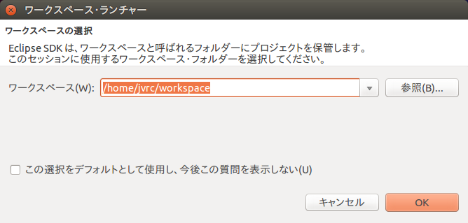
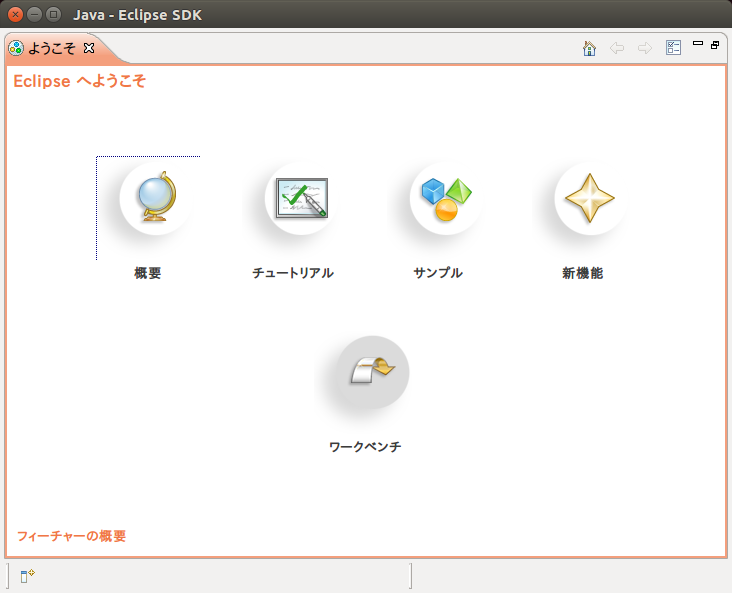
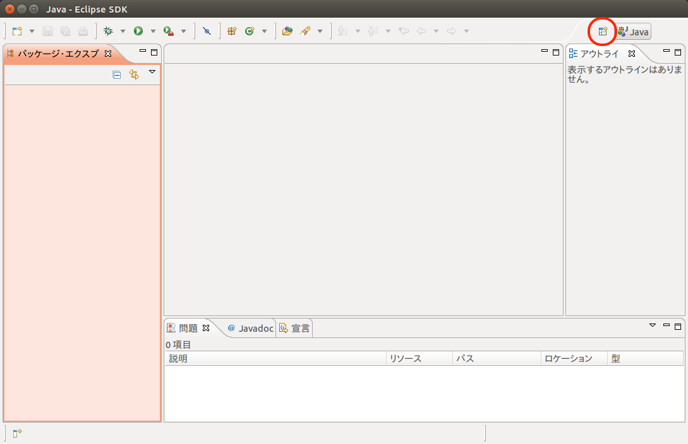
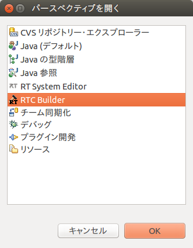
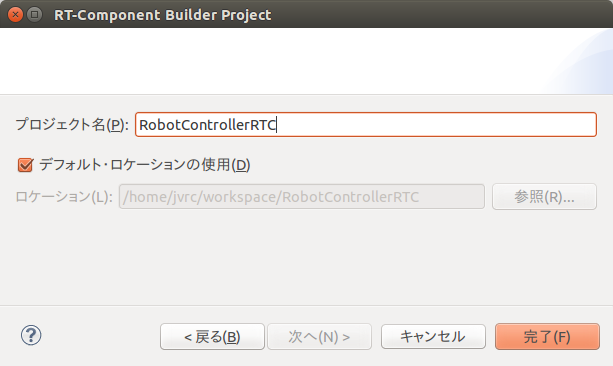
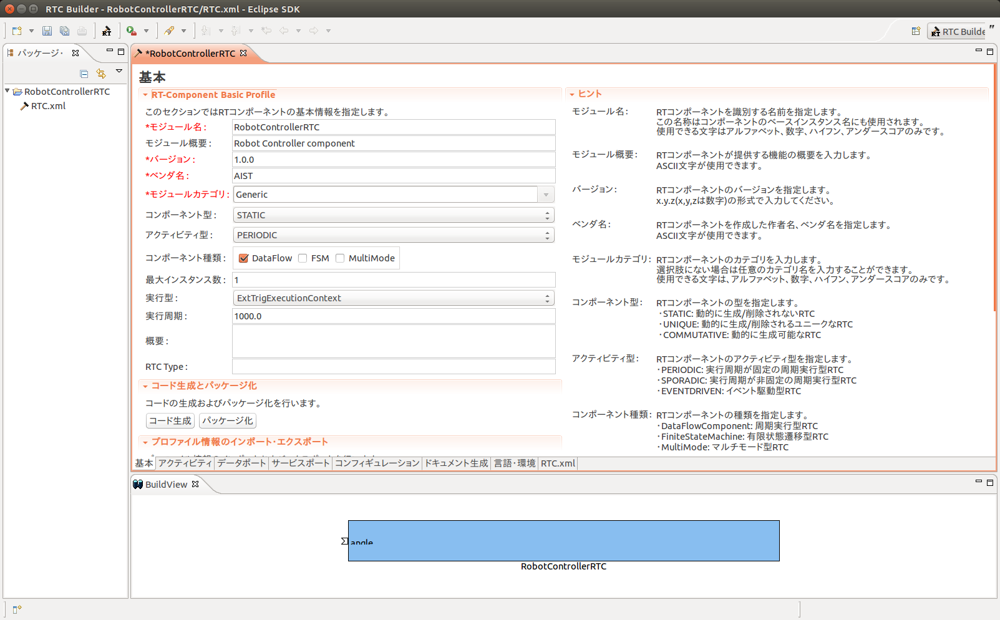
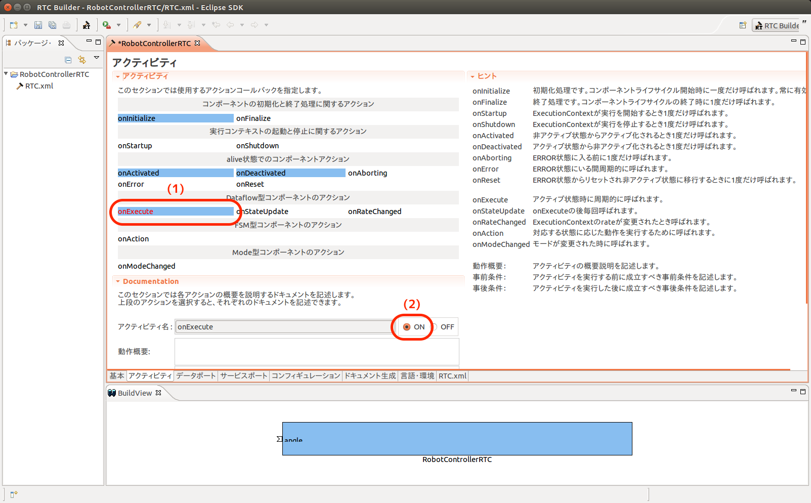
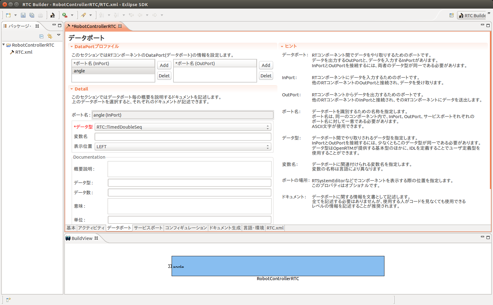
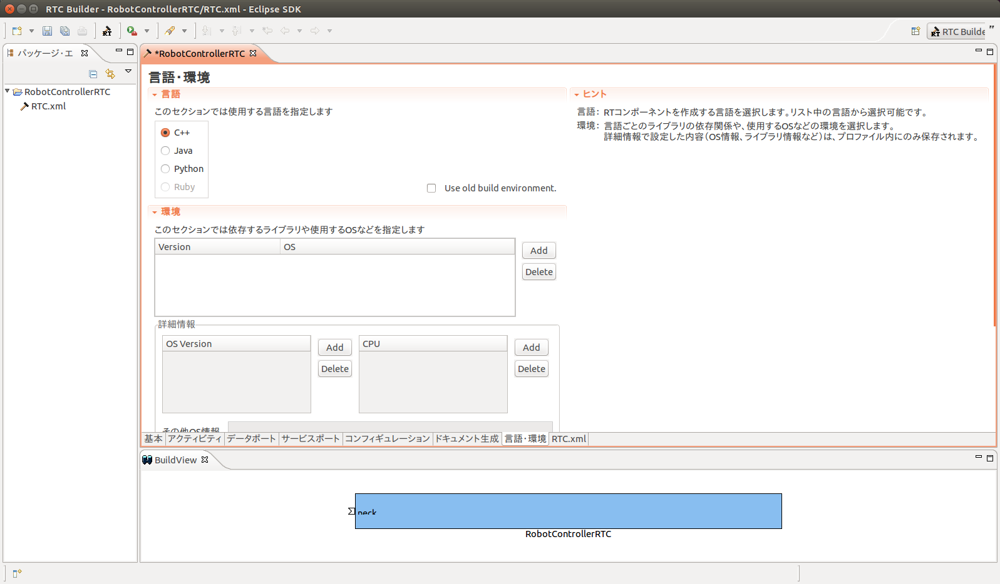
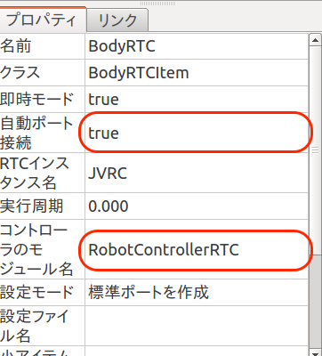

Connecting a RT component
=========================

This section explains how to connect Choreonoid and a RT component by developing an example component which read joint angles.

Open a project file
-------------------

Open a project file by choosing "Open Project" menu of "File" menu. The file name is samples/tutorials/cnoid/sample1.cnoid.

Add a controller
----------------

Select "JVRC" first in the item view.
Then create a BodyRTC item by choosing "BodyRTC" menu followed by "File", "New..." menus.

コントローラの雛形作成
----------------------

RTCBuilderを使ってコントローラのソースコードの雛形を作成します。

RTCBuilderの起動
################

以下を実行してRTCBuilder(OpenRTP, Eclipseベース)を起動します。

.. code-block:: bash

 $ openrtp

Eclipseが起動すると、ワークスペースの場所を尋ねられます。

Eclipseでは、各種作業を行うフォルダを「ワークスペース」(Work Space)とよび、原則としてすべての生成物はこのフォルダの下に保存されます。ワークスペースはアクセスできるフォルダであれば、どこに作っても構いませんが、このチュートリアルでは「/home/<ユーザ名>/workspace」をワークスペースとします。

そのままOKボタンを押してください。以下のようなWelcomeページが表示されます。

Welcomeページはいまは必要ないので左上の「×」ボタンを押して閉じてください。 

右上の「パースペクティブを開く」ボタンを押し、プルダウンの「その他(O)…」ボタンを押します。

「パースペクティブを開く」ダイアログが表示されるので、「RTC Builder」を選択してOKボタンを押すことで、RTCBuilderが起動します。メニューバーに「カナヅチとRT」のRTCBuilderのアイコンが現れます。

.. note::

  RTCBuilderを起動する際に以下のエラーが生じることがあります。

  .. code-block:: bash

    パースペクティブ 'jp.go.aist.rtm.rtcbuilder.ui.perspective' のオープンで問題が発生しました。
  
  RTCBuilderを起動した端末には以下のメッセージが出ているかと思います。
   
  .. code-block:: bash

    java.io.IOException: Couldn't get lock for rtcbuilder%u.log

  既知のバグが影響している可能性があるので、対処方法として以下を行ってください。

  * logger.properties ファイルを作成して以下のようにログファイルパターンを記載しておく。

    .. code-block:: bash

     jp.go.aist.rtm.rtcbuilder.RTCBLogHandler.pattern=%h/.rtcb%u.log
     jp.go.aist.rtm.systemeditor.RTSELogHandler.pattern=%h/.rtse%u.log

  * 起動時のオプションでこのファイルをロガークラスのコンフィギュレーションとして読み込ませて"openrtp"を起動する。

    .. code-block:: bash

     $ openrtp -vmargs -Djava.util.logging.config.file=$HOME/workspace/logger.properties

新規プロジェクトの作成
######################

RTコンポーネントを作成するために、RTCBuilderで新規プロジェクトを作成する必要が有ります。プロジェクトを作成する方法は2種類あります。

1. 画面上部のメニューから[ファイル]－[新規]－[プロジェクト]を選択 (Eclipse共通)

   * 「新規プロジェクト」画面において，[その他]－[RTC Builder]を選択し、[次へ]をクリック
   
     .. image:: images/openrtp_new_project.png

2. メニューバーの「RTCBuilder」のアイコンをクリック

どちらの方法でも、次のようなプロジェクト作成ウィザードが開始されます。「プロジェクト名」欄に作成するプロジェクト名(ここでは"RobotControllerRTC")を入力して「完了」を押します。

指定した名称のプロジェクトが生成され、パッケージエクスプローラ内に追加されます。

生成したプロジェクト内には、デフォルト値が設定されたRTCプロファイルXML(RTC.xml)が自動的に生成されます。

.. RTCプロファイルエディタの起動
.. #############################

プロファイル情報入力とコードの生成
##################################

RTCBuilderのエディタで、いちばん左の「基本」タブを選択し、基本情報を入力します。RTコンポーネントの仕様(名前)の他に、概要やバージョン等を入力します。ラベルが赤字の項目は必須項目です。その他はデフォルトで構いません。

===================  ==========================
モジュール名:        RobotControllerRTC
モジュール概要:      Robot Controller component
バージョン:          1.0.0
ベンダ名:            AIST
モジュールカテゴリ:  Generic
コンポーネント型:    STATIC
アクティビティ型:    PERIODIC
コンポーネント種類:  DataFlow
最大インスタンス数:  1
実行型:              PeriodicExecutionContext
実行周期:            1000.0
===================  ==========================

次に「アクティビティ」タブを選択し、使用するアクションコールバックを指定します。

本コンポーネントでは、onActivated(), onDeactivated(), onExecute() コールバックを使用します。下図のように(1)コールバックをクリック後に(2)のラジオボタン"ON"にチェックを入れます。使用するコールバックごとに同様の手順で"ON"にしていきます。

さらに、「データポート」タブを選択し、データポートの情報を入力します。 以下のように入力します。なお、変数名や表示位置はオプションなのでデフォルトのままで構いません。

* InPort プロファイル:

  =========  ==========================
  ポート名:  q
  データ型:  RTC::TimeDoubleSeq
  変数名:    angle
  表示位置:  LEFT
  =========  ==========================

* OutPort プロファイル:

  なし
  

次に、「言語・環境」タブを選択し、プログラミング言語を選択します。 ここでは、「C++」を選択します。なお、言語・環境はデフォルト等が設定されておらず、指定し忘れるとコード生成時にエラーになりますので、必ず言語の指定を行うようにしてください。

また、C++の場合デフォルトではCMakeを利用してビルドすることになっていますが、旧式のVCのプロジェクトやソリューションを直接RTCBuilderが生成する方法を利用したい場合は Use old build environment をチェックしてください。

最後に、「基本」タブにある「コード生成」ボタンをクリックし、コンポーネントの雛型を生成します。

.. image:: images/rtcbuilder_basic_generate.png

※ 生成されるコード群は、eclipse起動時に指定したワークスペースフォルダの中に生成されます。現在のワークスペースは、「ファイル(F)」 > 「ワークスペースの切り替え(W)...」で確認することができます。

.. 仮ビルド
.. ########
.. 
.. さて、ここまででRTコンポーネントのソースコードの雛形が生成されました。処理の中身は実装されていないので、InPortに入力があっても何も出力されませんが、生成直後のソースコードだけでもコンパイルおよび実行は可能です。
.. 
.. ※サービスポートとプロバイダを持つコンポーネントの場合、実装を行わないとビルドが通らないものもあります。
.. 
.. では、まずCMakeを利用してビルド環境のConfigureを行います。RTコンポーネントのソースが生成されたディレクトリで以下を実行すると、Configureおよびビルドが完了するはずです。
.. 
.. .. code-block:: bash
.. 
..  $ cd $HOME/workspace/RobotControllerRTC
..  $ mkdir build
..  $ cd build
..  $ cmake ..
..  $ make
.. 
.. ビルド終了後、空のRobotControllerRTCCompを起動してみましょう。
.. 
.. 起動後、RTSystemEditorなどでアクセスしてみてください。RobotControllerRTC0というコンポーネントが表示されているはずです。
.. 

コントローラのソースコード
--------------------------

コード作成操作により、コントローラのソースコード一式がワークスペース内の領域「$HOME/workspace/RobotControllerRTC/」に生成されます。

コントローラのヘッダファイル
############################

コントローラのヘッダファイルは以下になります。

  $HOME/workspace/include/RobotControllerRTC/RobotControllerRTC.h

※ 一部のコメント行は除去しています。

.. code-block:: cpp
   :linenos:

   /*!
    * @file  RobotControllerRTC.h
    * @brief Robot Controller component
    * @date  $Date$
    *
    * $Id$
    */
   
   #ifndef ROBOTCONTROLLERRTC_H
   #define ROBOTCONTROLLERRTC_H
   
   #include <rtm/idl/BasicDataTypeSkel.h>
   #include <rtm/idl/ExtendedDataTypesSkel.h>
   #include <rtm/idl/InterfaceDataTypesSkel.h>
   
   using namespace RTC;
   
   #include <rtm/Manager.h>
   #include <rtm/DataFlowComponentBase.h>
   #include <rtm/CorbaPort.h>
   #include <rtm/DataInPort.h>
   #include <rtm/DataOutPort.h>
   
   class RobotControllerRTC
     : public RTC::DataFlowComponentBase
   {
     public:
       RobotControllerRTC(RTC::Manager* manager);
       ~RobotControllerRTC();
       virtual RTC::ReturnCode_t onInitialize();
       virtual RTC::ReturnCode_t onActivated(RTC::UniqueId ec_id);
       virtual RTC::ReturnCode_t onDeactivated(RTC::UniqueId ec_id);
       virtual RTC::ReturnCode_t onExecute(RTC::UniqueId ec_id);
   
    protected:
      RTC::TimedDoubleSeq m_angle;
      InPort<RTC::TimedDoubleSeq> m_angleIn;
   
    private:
   
   };
   
   extern "C"
   {
     DLL_EXPORT void RobotControllerRTCInit(RTC::Manager* manager);
   };
   
   #endif // ROBOTCONTROLLERRTC_H

今回、ヘッダファイルは変更しません。

RTC::TimedDoubleSeq というのは、時刻情報とdouble型の実際の値を持つOpenRTM固有の複合型です。
SeqはOpenRTMにおける配列型のように扱います。
OpenRTMにおけるdouble[]型と考えておけばよいでしょう。

InPort<RTC::TimedDoubleSeq> はRTCの入力ポートを表す型であり、入力ポートを操作するにはこれを利用します。
m_angleは入力ポートから関節角度を受けとるための変数です。
m_angleInで取得した値はm_angleで参照します。

コントローラのソースコード
##########################

コントローラのソースコードは以下になります。

  $HOME/workspace/RobotControllerRTC/src/RobotControllerRTC.cpp

※ 一部のコメント行は除去しています。

.. code-block:: cpp
   :linenos:

   /*!
    * @file  RobotControllerRTC.cpp
    * @brief Robot Controller component
    * @date $Date$
    *
    * $Id$
    */
   
   #include "RobotControllerRTC.h"
   
   // Module specification
   static const char* robotcontrollerrtc_spec[] =
     {
       "implementation_id", "RobotControllerRTC",
       "type_name",         "RobotControllerRTC",
       "description",       "Robot Controller component",
       "version",           "1.0.0",
       "vendor",            "AIST",
       "category",          "Generic",
       "activity_type",     "PERIODIC",
       "kind",              "DataFlowComponent",
       "max_instance",      "1",
       "language",          "C++",
       "lang_type",         "compile",
       ""
     };
   
   RobotControllerRTC::RobotControllerRTC(RTC::Manager* manager)
     : RTC::DataFlowComponentBase(manager),
       m_angleIn("q", m_angle)
   {
   }
   
   RobotControllerRTC::~RobotControllerRTC()
   {
   }
   
   RTC::ReturnCode_t RobotControllerRTC::onInitialize()
   {
     addInPort("q", m_angleIn);
     
     return RTC::RTC_OK;
   }
   
   RTC::ReturnCode_t RobotControllerRTC::onActivated(RTC::UniqueId ec_id)
   {
     return RTC::RTC_OK;
   }
   
   RTC::ReturnCode_t RobotControllerRTC::onDeactivated(RTC::UniqueId ec_id)
   {
     return RTC::RTC_OK;
   }
   
   RTC::ReturnCode_t RobotControllerRTC::onExecute(RTC::UniqueId ec_id)
   {
     return RTC::RTC_OK;
   }
   
   extern "C"
   {
    
     void RobotControllerRTCInit(RTC::Manager* manager)
     {
       coil::Properties profile(robotcontrollerrtc_spec);
       manager->registerFactory(profile,
                                RTC::Create<RobotControllerRTC>,
                                RTC::Delete<RobotControllerRTC>);
     }
     
   };

これはコントローラの雛形なので、onExecute() コールバックなどに処理を追加します。

雛形に追加するコードの差分(diff)は以下の通りです。

patch コマンドで差分を適用する場合は、こちらの
:download:`差分ファイル <src/RobotControllerRTC.cpp.diff>` を取得してご利用ください。

.. code-block:: cpp
   :linenos:

   --- RobotControllerRTC.cpp.orig	2015-12-03 11:11:10.351220019 +0900
   +++ RobotControllerRTC.cpp	2015-12-03 11:13:11.787219170 +0900
   @@ -8,6 +8,9 @@
     */
    
    #include "RobotControllerRTC.h"
   +#include <iostream>
   +
   +using namespace std;
    
    // Module specification
    // <rtc-template block="module_spec">
   @@ -109,6 +112,14 @@
    
    RTC::ReturnCode_t RobotControllerRTC::onExecute(RTC::UniqueId ec_id)
    {
   +  if(m_angleIn.isNew()){
   +    m_angleIn.read();
   +  }
   +
   +  for(size_t i=0; i < m_angle.data.length(); ++i){
   +    cout << "m_angle.data[" << i << "] is " << m_angle.data[i] << std::endl;
   +  }
   +
      return RTC::RTC_OK;
    }

RobotControllerRTCのコンストラクタで、m_angleIn と m_angle を関連付けています。

RTCの初期化時に呼ばれるonInitialize()で、m_angleInをRTCの入力ポートqと関連づけています。

onExecute()はRTCの実行中に定期的に呼ばれます。
ここでは関節角度を取得し標準出力に表示する処理を行っています。
m_angleIn.isNew()とは新しいデータが到着しているか確認する関数です。
onExecute()の実行時にはデータが到着しているかどうかが分からないので、ここでチェックしています。
新しいデータが来ていた場合にはm_angleIn.read()でデータを読み込みます。
読み込んだデータは自動的にm_angleに格納され、m_angle.dataとして取得できます。
m_angle.dataは各関節毎に配列の値となっています。

コントローラのビルド
--------------------

RTコンポーネントのソースファイル一式が生成されたディレクトリで以下を実行します。CMakeを利用してビルド環境のConfigureを行ってから、makeを実行してビルドします。

.. code-block:: bash

 $ cd $HOME/workspace/RobotControllerRTC
 $ mkdir build
 $ cd build
 $ cmake ..
 $ make

ビルドに成功するとRTCコントローラモジュール「src/RobotControllerRTC.so」が生成されるので、以下を実行して配置します。

.. code-block:: bash 

 $ sudo mkdir -p /usr/lib/choreonoid-1.5/rtc
 $ sudo cp -p src/RobotControllerRTC.so /usr/lib/choreonoid-1.5/rtc

.. note::
   
  Choreonoidでは読み込むRTCコントローラのモジュールは、Choreonoidのインストール先の共有ディレクトリ(/usr/lib/choreonoid-1.5/rtc)に配置しなければなりません。

コントローラの設定
------------------

プロジェクト上でRTコンポーネント(RTC)を作成しただけでは、ロボットの制御を行うことができません。

Choreonoidの操作画面に戻って、アイテムビューで「BodyRTC」を選択するとプロパティのタブ(プロパティビューと言います)にRTCの設定が表示されます。プロパティビューの「コントローラのモジュール名」を「RobotControllerRTC」とします。これは「コントローラのビルド」で作成したモジュールのパスと対応しています。さらに、プロパティビューの「自動ポート接続」を true にします。

シミュレーションを実行する
--------------------------

シミュレーションツールバーの「シミュレーション開始ボタン」を押します。シミュレーションを実行するとChoreonoidを実行している端末に関節角度(m_angle)の値が表示されるはずです。

.. image:: images/output.png

このようにして得られる関節角度を基にトルクをロボットに入力することでロボットの制御を行うことができます。この後のサンプルで詳しく解説します。

.. toctree::
   :maxdepth: 2
