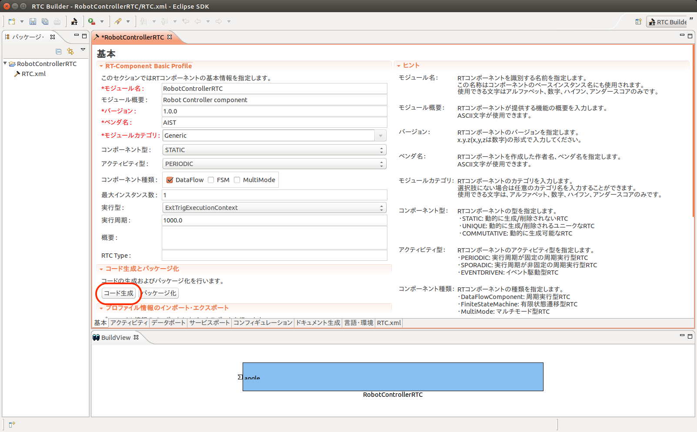

Connecting a RT component
=========================

This section explains how to connect Choreonoid and a RT component by developing an example component which read joint angles.

Open a project file
-------------------

Open a project file by choosing "Open Project" menu of "File" menu. The file name is samples/tutorials/cnoid/sample1.cnoid.

Add a controller
----------------

Select "JVRC" first in the item view.
Then create a BodyRTC item by choosing "BodyRTC" menu followed by "File", "New..." menus.

コントローラの雛形作成
----------------------

RTCBuilderを使ってコントローラのソースコードの雛形を作成します。

RTCBuilderの起動
################

Eclipseを起動すると、ワークスペースの場所を尋ねられます。

.. image:: images/openrtp_make_workspace.png

Eclipseでは、各種作業を行うフォルダを「ワークスペース」(Work Space)とよび、原則としてすべての生成物はこのフォルダの下に保存されます。ワークスペースはアクセスできるフォルダであれば、どこに作っても構いませんが、このチュートリアルでは「/home/<ユーザ名>/workspace」をワークスペースとします。

そのままOKボタンを押してください。以下のようなWelcomeページが表示されます。

.. image:: images/openrtp_welcome.png

Welcomeページはいまは必要ないので左上の「×」ボタンを押して閉じてください。 

.. image:: images/openrtp_init_screen.png

右上の「パースペクティブを開く」ボタンを押し、プルダウンの「その他(O)…」ボタンを押します。

.. image:: images/openrtp_open_perspective.png

「パースペクティブを開く」ダイアログが表示されるので、「RTC Builder」を選択してOKボタンを押すことで、RTCBuilderが起動します。メニューバーに「カナヅチとRT」のRTCBuilderのアイコンが現れます。
           
新規プロジェクトの作成
######################

RTコンポーネントを作成するために、RTCBuilderで新規プロジェクトを作成する必要が有ります。プロジェクトを作成する方法は2種類あります。

1. 画面上部のメニューから[ファイル]－[新規]－[プロジェクト]を選択 (Eclipse共通)

   * 「新規プロジェクト」画面において，[その他]－[RTC Builder]を選択し、[次へ]をクリック
   
     .. image:: images/openrtp_new_project.png

2. メニューバーの「RTCBuilder」のアイコンをクリック

どちらの方法でも、次のようなプロジェクト作成ウィザードが開始されます。「プロジェクト名」欄に作成するプロジェクト名(ここでは"RobotControllerRTC")を入力して「完了」を押します。

.. image:: images/openrtp_make_project.png

指定した名称のプロジェクトが生成され、パッケージエクスプローラ内に追加されます。

生成したプロジェクト内には、デフォルト値が設定されたRTCプロファイルXML(RTC.xml)が自動的に生成されます。

.. RTCプロファイルエディタの起動
.. #############################

プロファイル情報入力とコードの生成
##################################

RTCBuilderのエディタで、いちばん左の「基本」タブを選択し、基本情報を入力します。RTコンポーネントの仕様(名前)の他に、概要やバージョン等を入力します。ラベルが赤字の項目は必須項目です。その他はデフォルトで構いません。

===================  ==========================
モジュール名:        RobotControllerRTC
モジュール概要:      Robot Controller component
バージョン:          1.0.0
ベンダ名:            AIST
モジュールカテゴリ:  Generic
コンポーネント型:    STATIC
アクティビティ型:    PERIODIC
コンポーネント種類:  DataFlow (DataFlowComponent)
最大インスタンス数:  1
実行型:              PeriodicExecutionContext
実行周期:            1000.0
===================  ==========================

.. image:: images/rtcbuilder_basic.png

次に「アクティビティ」タブを選択し、使用するアクションコールバックを指定します。

本コンポーネントでは、onActivated(), onDeactivated(), onExecute() コールバックを使用します。下図のように(1)コールバックをクリック後に(2)のラジオボタン"ON"にチェックを入れます。使用するコールバックごとに同様の手順で"ON"にしていきます。

.. image:: images/rtcbuilder_activity.png

さらに、「データポート」タブを選択し、データポートの情報を入力します。 以下のように入力します。なお、変数名や表示位置はオプションなのでデフォルトのままで構いません。

* InPort プロファイル:

  =========  ==========================
  ポート名:  neck
  データ型:  RTC::TimeDoubleSeq
  変数名:    
  表示位置:  LEFT
  =========  ==========================

* OutPort プロファイル:

  なし
  
.. image:: images/rtcbuilder_dataport.png

次に、「言語・環境」タブを選択し、プログラミング言語を選択します。 ここでは、「C++」を選択します。なお、言語・環境はデフォルト等が設定されておらず、指定し忘れるとコード生成時にエラーになりますので、必ず言語の指定を行うようにしてください。

また、C++の場合デフォルトではCMakeを利用してビルドすることになっていますが、旧式のVCのプロジェクトやソリューションを直接RTCBuilderが生成する方法を利用したい場合は Use old build environment をチェックしてください。

.. image:: images/rtcbuilder_lang.png

最後に、「基本」タブにある「コード生成」ボタンをクリックし、コンポーネントの雛型を生成します。

※ 生成されるコード群は、eclipse起動時に指定したワークスペースフォルダの中に生成されます。現在のワークスペースは、「ファイル(F)」 > 「ワークスペースの切り替え(W)...」で確認することができます。

仮ビルド
########

さて、ここまででRTコンポーネントのソースコードの雛形が生成されました。処理の中身は実装されていないので、InPortに入力があっても何も出力されませんが、生成直後のソースコードだけでもコンパイルおよび実行は可能です。

※サービスポートとプロバイダを持つコンポーネントの場合、実装を行わないとビルドが通らないものもあります。

では、まずCMakeを利用してビルド環境のConfigureを行います。RTコンポーネントのソースが生成されたディレクトリで以下を実行すると、Configureおよびビルドが完了するはずです。

.. code-block:: bash

 $ cd $HOME/workspace/RobotControllerRTC
 $ mkdir build
 $ cd build
 $ cmake ..
 $ make

ビルド終了後、空のRobotControllerRTCCompを起動してみましょう。

起動後、RTSystemEditorなどでアクセスしてみてください。RobotControllerRTC0というコンポーネントが表示されているはずです。

Source code of a controller
---------------------------

Contents of the header file of the controller is as follows. This file was created by modifying SR1WalkControllerRTC.h which is included in Choreonoid.

.. code-block:: cpp

   /**
      Sample Robot motion controller for the JVRC robot model.
      This program was ported from the "SR1WalkControllerRTC.h" sample of Choreonoid.
   */
   
   #ifndef RobotControllerRTC_H
   #define RobotControllerRTC_H
   
   #include <rtm/idl/BasicDataTypeSkel.h>
   #include <rtm/Manager.h>
   #include <rtm/DataFlowComponentBase.h>
   #include <rtm/CorbaPort.h>
   #include <rtm/DataInPort.h>
   #include <rtm/DataOutPort.h>
   #include <cnoid/MultiValueSeq>
   
   class RobotControllerRTC : public RTC::DataFlowComponentBase
   {
   public:
       RobotControllerRTC(RTC::Manager* manager);
       ~RobotControllerRTC();
   
       virtual RTC::ReturnCode_t onInitialize();
       virtual RTC::ReturnCode_t onActivated(RTC::UniqueId ec_id);
       virtual RTC::ReturnCode_t onDeactivated(RTC::UniqueId ec_id);
       virtual RTC::ReturnCode_t onExecute(RTC::UniqueId ec_id);
   
   protected:
       // DataInPort declaration
       RTC::TimedDoubleSeq m_angle;
       RTC::InPort<RTC::TimedDoubleSeq> m_angleIn;
   };
   
   extern "C"
   {
       DLL_EXPORT void RobotControllerRTCInit(RTC::Manager* manager);
   };
   
   #endif

`RTC::TimedDoubleSeq` is a type which contains time and double precision values. Seq means a sequence of values just like double[]. 

`RTC::InPort<RTC::TimedDoubleSeq>` defines an input data port. m_angle is a buffer to receive joint angles. Joint angles read through m_angleIn are stored in m_angle.

The following shows source code of the controller. It was developed based on SR1WalkControllerRTC.cpp which is included in Choreonoid.

.. code-block:: cpp

   /**
      Sample Robot motion controller for the JVRC robot model.
      This program was ported from the "SR1WalkControllerRTC.cpp" sample of
      Choreonoid.
   */
   
   #include "RobotControllerRTC.h"
   #include <cnoid/BodyMotion>
   #include <cnoid/ExecutablePath>
   #include <cnoid/FileUtil>
   #include <iostream>
   
   using namespace std;
   using namespace cnoid;
   
   namespace {
   
   const char* samplepd_spec[] =
   {
       "implementation_id", "RobotControllerRTC",
       "type_name",         "RobotControllerRTC",
       "description",       "Robot Controller component",
       "version",           "0.1",
       "vendor",            "AIST",
       "category",          "Generic",
       "activity_type",     "DataFlowComponent",
       "max_instance",      "10",
       "language",          "C++",
       "lang_type",         "compile",
       ""
   };
   }
   
   
   RobotControllerRTC::RobotControllerRTC(RTC::Manager* manager)
       : RTC::DataFlowComponentBase(manager),
         m_angleIn("q", m_angle)
   {
   
   }
   
   RobotControllerRTC::~RobotControllerRTC()
   {
   
   }
   
   
   RTC::ReturnCode_t RobotControllerRTC::onInitialize()
   {
       // Set InPort buffers
       addInPort("q", m_angleIn);
   
       return RTC::RTC_OK;
   }
   
   RTC::ReturnCode_t RobotControllerRTC::onActivated(RTC::UniqueId ec_id)
   {
       return RTC::RTC_OK;
   }
   
   
   RTC::ReturnCode_t RobotControllerRTC::onDeactivated(RTC::UniqueId ec_id)
   {
       return RTC::RTC_OK;
   }
   
   RTC::ReturnCode_t RobotControllerRTC::onExecute(RTC::UniqueId ec_id)
   {
       if(m_angleIn.isNew()){
           m_angleIn.read();
       }
   
       for(size_t i=0; i < m_angle.data.length(); ++i){
               cout << "m_angle.data[" << i << "] is " << m_angle.data[i] << std::endl;
       }
   
       return RTC::RTC_OK;
   }
   
   
   extern "C"
   {
       DLL_EXPORT void RobotControllerRTCInit(RTC::Manager* manager)
       {
           coil::Properties profile(samplepd_spec);
           manager->registerFactory(profile,
                                    RTC::Create<RobotControllerRTC>,
                                    RTC::Delete<RobotControllerRTC>);
       }
   };

m_angleIn and m_angle are associated by constructor of RobotControllerRTC.

onInitialized is called right after a RT component is constructed. It registers the input port.

onExecute() is a function called periodically. Its implementation of this tutorial just reads joint angles and outputs those values to standard output. m_angleIn.isNew() checks if new data arrived or not. If the arrival is detected, m_angleIn.read() reads data and stores values to m_angle. Joint angles are accesible through m_angle.data.

These source codes are stored as samples/tutorials/rtc/RobotControllerRTC.cpp and samples/tutorials/rtc/RobotControllerRTC.h.

Setup the controller
--------------------

To connect Choreonoid and the RT component we developed, we need to configure BodyRTC item.

When you select BodyRTC item, its properties are displayed in the tab which is called "property view". Set "RobotControllerRTC" to the value of "Controller module name". This corresponds to the filename of the RT component. Set true to the value of "Auto Connect".

.. image:: images/property_rtc.png

Build the controller
--------------------

Go to samples/tutorials/rtc directory and execute the following command.

.. code-block:: bash 

   $ make

This command generates RobotControllerRTC.so under samples/tutorials/rtc directory.

Then execute the following command.

.. code-block:: bash 

   $ sudo make install DESTDIR=/usr

In order to use RT components from Choreonoid, we need to put them in the shared directory of Choreonoid(/usr/lib/choreonoid-1.5/rtc). "make install" command does this automatically.

Run simulation
--------------

Press "Start simulation from the beginning" button on the simulation tool bar. While the simulation is running, joint angles stored in m_angle are displayed in the terminal you launched Choreonoid.

.. image:: images/output.png

Applying joint torques computed using joint angles, we can control joint positions. The next tutorial explains how to do that.

A sample project used in this tutorial
--------------------------------------

You can find a sample project file created by this tutorial in samples/tutorials/cnoid/sample2.cnoid.

.. toctree::
   :maxdepth: 2

