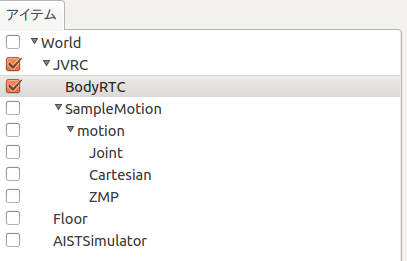
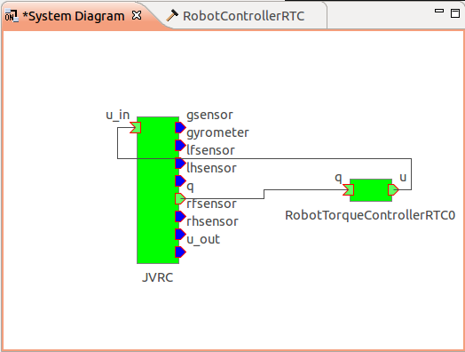

Joint control using a RT component
==================================

This section extentds the RT component developed in the previous section to keep the robot standing position.

RTコンポーネントの拡張
----------------------
関節のPD制御を行うために、前の節で作成したRTコンポーネントRobotControllerRTCを拡張します。PD制御を行うためには、関節へのトルク指令を出力する必要があるため、トルク指令用のデータポートをRTCBuilderを用いて追加します。追加するデータポートのプロファイルは次のようになります。

* OutPort プロファイル:

  =========  ==========================
  ポート名:  u
  データ型:  RTC::TimeDoubleSeq
  変数名:    torque
  表示位置:  RIGHT
  =========  ==========================

データポートを追加し、再度コード生成を行ったら、ビルドができることを確認しておきます。

Source code of a controller
---------------------------

A header file of the controller is as follows. 

.. code-block:: cpp
   :linenos:

   /*!
    * @file  RobotControllerRTC.h
    * @brief Robot Controller component
    * @date  $Date$
    *
    * $Id$
    */
   
   #ifndef ROBOTCONTROLLERRTC_H
   #define ROBOTCONTROLLERRTC_H
   
   #include <rtm/idl/BasicDataTypeSkel.h>
   #include <rtm/idl/ExtendedDataTypesSkel.h>
   #include <rtm/idl/InterfaceDataTypesSkel.h>
   
   using namespace RTC;
   
   #include <rtm/Manager.h>
   #include <rtm/DataFlowComponentBase.h>
   #include <rtm/CorbaPort.h>
   #include <rtm/DataInPort.h>
   #include <rtm/DataOutPort.h>
   
   class RobotControllerRTC
     : public RTC::DataFlowComponentBase
   {
     public:
       RobotControllerRTC(RTC::Manager* manager);
       ~RobotControllerRTC();
       virtual RTC::ReturnCode_t onInitialize();
       virtual RTC::ReturnCode_t onActivated(RTC::UniqueId ec_id);
       virtual RTC::ReturnCode_t onDeactivated(RTC::UniqueId ec_id);
       virtual RTC::ReturnCode_t onExecute(RTC::UniqueId ec_id);
   
    protected:
      RTC::TimedDoubleSeq m_angle;
      InPort<RTC::TimedDoubleSeq> m_angleIn;
   
      RTC::TimedCharSeq m_torque;
      OutPort<RTC::TimedCharSeq> m_torqueOut;
    private:
   
   };
   
   extern "C"
   {
     DLL_EXPORT void RobotControllerRTCInit(RTC::Manager* manager);
   };
   
   #endif // ROBOTCONTROLLERRTC_H

An output data port is added to output joint torques. `RTC::OutPort<RTC::TimedDoubleSeq>`  is the definition of the output port.

Source codes of the controller are as follows. This file was created by modifying SR1WalkConrollerRTC.cpp which is included in Choreonoid.

.. code-block:: cpp
   :linenos:

   /*!
    * @file  RobotControllerRTC.cpp
    * @brief Robot Controller component
    * @date $Date$
    *
    * $Id$
    */
   
   #include "RobotControllerRTC.h"
   #include <cnoid/BodyMotion>
   #include <cnoid/ExecutablePath>
   #include <cnoid/FileUtil>
   
   using namespace std;
   using namespace cnoid;
   
   namespace {
   
   static const double pgain[] = {
       50000.0, 30000.0, 30000.0, 30000.0, 30000.0,
       80000.0, 80000.0, 10000.0, 3000.0, 30000.0,
       30000.0, 80000.0, 3000.0, 30000.0, 10000.0,
       3000.0, 3000.0, 30000.0, 30000.0, 10000.0,
       3000.0, 30000.0, 3000.0, 3000.0, 3000.0,
       3000.0, 3000.0, 3000.0, 3000.0, 3000.0,
       3000.0, 3000.0, 10000.0, 3000.0, 3000.0,
       30000.0, 3000.0, 3000.0, 3000.0, 3000.0,
       3000.0, 3000.0, 3000.0, 3000.0,
       };
   
   static const double dgain[] = {
       100.0, 100.0, 100.0, 100.0, 100.0,
       100.0, 100.0, 100.0, 100.0, 100.0,
       100.0, 100.0, 100.0, 100.0, 100.0,
       100.0, 100.0, 100.0, 100.0, 100.0,
       100.0, 100.0, 100.0, 100.0, 100.0,
       100.0, 100.0, 100.0, 100.0, 100.0,
       100.0, 100.0, 100.0, 100.0, 100.0,
       100.0, 100.0, 100.0, 100.0, 100.0,
       100.0, 100.0, 100.0, 100.0,
       };
   
   // Module specification
   static const char* robotcontrollerrtc_spec[] =
     {
       "implementation_id", "RobotControllerRTC",
       "type_name",         "RobotControllerRTC",
       "description",       "Robot Controller component",
       "version",           "1.0.0",
       "vendor",            "AIST",
       "category",          "Generic",
       "activity_type",     "PERIODIC",
       "kind",              "DataFlowComponent",
       "max_instance",      "1",
       "language",          "C++",
       "lang_type",         "compile",
       ""
     };
   
   RobotControllerRTC::RobotControllerRTC(RTC::Manager* manager)
     : RTC::DataFlowComponentBase(manager),
       m_angleIn("q", m_angle),
       m_torqueOut("u", m_torque)
   {
   }
   
   RobotControllerRTC::~RobotControllerRTC()
   {
   
   }
   
   
   RTC::ReturnCode_t RobotControllerRTC::onInitialize()
   {
     addInPort("q", m_angleIn);
     addOutPort("u", m_torqueOut);
   
     return RTC::RTC_OK;
   }
   
   RTC::ReturnCode_t RobotControllerRTC::onActivated(RTC::UniqueId ec_id)
   {
     if(!qseq){
       string filename = getNativePathString(
         boost::filesystem::path(shareDirectory())
         / "motion" / "RobotPattern.yaml");
   
       BodyMotion motion;
   
       if(!motion.loadStandardYAMLformat(filename)){
         cout << motion.seqMessage() << endl;
         return RTC::RTC_ERROR;
       }
       qseq = motion.jointPosSeq();
       if(qseq->numFrames() == 0){
         cout << "Empty motion data." << endl;
         return RTC::RTC_ERROR;
       }
       q0.resize(qseq->numParts());
       timeStep_ = qseq->getTimeStep();
     }
   
     m_torque.data.length(qseq->numParts());
   
     if(m_angleIn.isNew()){
       m_angleIn.read();
     }
     for(int i=0; i < qseq->numParts(); ++i){
       q0[i] = m_angle.data[i];
     }
     oldFrame = qseq->frame(0);
     currentFrame = 0;
   
     return RTC::RTC_OK;
   }
   
   
   RTC::ReturnCode_t RobotControllerRTC::onDeactivated(RTC::UniqueId ec_id)
   {
     return RTC::RTC_OK;
   }
   
   RTC::ReturnCode_t RobotControllerRTC::onExecute(RTC::UniqueId ec_id)
   {
     if(m_angleIn.isNew()){
       m_angleIn.read();
     }
   
     if(currentFrame > qseq->numFrames()){
       m_torqueOut.write();
       return RTC::RTC_OK;
     }
   
     MultiValueSeq::Frame frame = qseq->frame(currentFrame++);
   
     for(int i=0; i < frame.size(); i++){
       double q_ref = frame[i];
       double q = m_angle.data[i];
       double dq_ref = (q_ref - oldFrame[i]) / timeStep_;
       double dq = (q - q0[i]) / timeStep_;
       m_torque.data[i] = (q_ref - q) * pgain[i]/100.0 + (dq_ref - dq) * dgain[i]/100.0;
       q0[i] = q;
   
       cout << "i = " << i << " ";
       cout << "q_ref = " << frame[i] << " ";
       cout << "q = " << q << " ";
       cout << "dq_ref = " << dq_ref << " ";
       cout << "dq = " << dq << " ";
       cout << "torque = " << m_torque.data[i] << endl;
     }
     oldFrame = frame;
   
     m_torqueOut.write();
   
     return RTC::RTC_OK;
   }
   
   
   extern "C"
   {
     DLL_EXPORT void RobotControllerRTCInit(RTC::Manager* manager)
     {
       coil::Properties profile(robotcontrollerrtc_spec);
       manager->registerFactory(profile,
                                RTC::Create<RobotControllerRTC>,
                                RTC::Delete<RobotControllerRTC>);
     }
   };

The procedure to add an output port is similar to adding an input port.

Let's look at implementation of onActivated(). This function is called only once when a RT component is activated. This function reads RobotPattern.yaml in shared data directory of Choreonoid. This file contains joint angle trajectories and it can be loaded by calling `motion.loadStandardYAMLformat()`. onActivated() initializes other variables.

Computation of joint torques is added to onExecute(). After reading joint angles, joint torques are computed and stored to m_torque.data[i]. In this tutorial, joint torques are computed by simple PD control. Position gains and derivative gains are defined at the top of the source code. If we can't control joints property, we need to adjust those values. Values stored in `m_torque.data`" are output by calling `m_torqueOut.write()`.

Build the controller
--------------------

コントローラの実装ができたので、再度makeをし、前節と同じ場所にRTCをインストールします。

.. code-block:: bash

 $ make
 $ sudo cp -p src/RobotControllerRTC.so /usr/lib/choreonoid-1.5/rtc

Choreonoidの起動
----------------

前節で作成したプロジェクトファイル、sample2.cnoidを開きます。

.. code-block:: bash

 $ choreonoid sample2.cnoid

Create a pose sequence item
---------------------------

Choose JVRC in the item view first. Then create a pose sequence item named SimpleMotion by choosing "PoseSeq" menu followed by "File", "New..." menus.

.. image:: images/motion.png

Then choose "Pose Roll" followed by "View", "Show View" menus. You will see a window as follows.

.. image:: images/pose_role.png

Choose "JVRC" in the item view and Press "Set the present initial pose to the selected bodies" button on the tool bar to make the robot to be in the initial posture.

.. image:: images/pose_toolbar.png

ポーズロールにおいて、1.0 を選択して「挿入」を押します。

   .. image:: images/poserole_neck_01.png

今回は首を左右に振る動作パターンを作成します。以下の手順でポーズを作成してください。

1. ポーズロールにおいて 2.0 を選択し、関節スライダにおいて首関節のヨー軸「NECK_Y」を 70.0 にセットし、ポーズロールの「挿入」を押す。

   .. image:: images/poserole_neck_02.png

2. ポーズロールにおいて 3.0 を選択し、関節スライダにおいて首関節のヨー軸「NECK_Y」を 0.0 にセットし、ポーズロールの「挿入」を押す。

   .. image:: images/poserole_neck_03.png

3. ポーズロールにおいて 4.0 を選択し、関節スライダにおいて首関節のヨー軸「NECK_Y」を -70.0 にセットし、ポーズロールの「挿入」を押す。

   .. image:: images/poserole_neck_04.png

4. ポーズロールにおいて 5.0 を選択し、関節スライダにおいて首関節のヨー軸「NECK_Y」を 0.0 にセットし、ポーズロールの「挿入」を押す。

   .. image:: images/poserole_neck_05.png

5. ポーズロールにおいて 6.0 を選択し、関節スライダにおいて首関節のヨー軸「NECK_R」を -50.0 にセットし、ポーズロールの「挿入」を押す。

   .. image:: images/poserole_neck_06.png

What we created using the pose roll are called key frames. They are used to generate a robot motion. Press "Generate body motions" button on the tool bar.

.. image:: images/motion_toolbar.png

It is possible to update the robot motion automatically when key frames are updated. It can be enabled by checking  "Automatic Balance Adjustment Mode" button on the tool bar.

.. image:: images/motion_toolbar2.png

You can find a "motion" item as a child of "SampleMotion" item. Select this item and save its contents by choosing "Save Selected Items As" menu.

.. image:: images/item_motion.png

ファイル名はRobotPattern.yamlとし、コントローラが参照するChoreonoidの共有ディレクトリ、/usr/share/choreonoid-1.5/motionに置いておきます。

Setup of the controller
-----------------------

Choreonoidには1体のロボットに複数のコントローラを割り当てる機能があります。今JVRCの子アイテムとしてBodyRTCとSampleMotionの2つがありますが、これら2つのうちどちらをシミュレーション時に使用するかを指定する必要があります。ここではBodyRTCを使いますのでBodyRTCの方にチェックを入れておきます。

Run simulation
--------------

シミュレーションを実行すると今度はロボットが崩れ落ちることなく、先ほど作成した首振りのモーションを実行しているはずです。この時RTSystemEditorでRTCの接続を確認すると、下図のようになっており、フィードバックループができていることが確認できます。

.. note::

  別のシーンビューを生成して、同時にカメラの映像を表示してみましょう。

  メインメニュー「表示」の「ビューの生成」から「シーン」を選択します。次のウィンドウが表示されるので OK をクリックします。

  .. image:: images/make_sceneview.png

  新しいシーンビュー「シーン2」が生成されます。
  「シーン2」タブをクリックして選択し、カメラの選択ボタンでロボットのカメラ「JVRC - rcamera」などに表示を切り替えます。

  .. image:: images/simulation_torque_2.png

  「シーン2」タブをドラッグして二つのシーンを同時に表示することもできます。
           
  .. image:: images/simulation_torque_3.png

サンプルファイルについて
------------------------

このチュートリアルで作成されるプロジェクトファイルはcnoid/sample3.cnoidに、コントローラのソースコードはrtc/RobotTorqueControllerRTC.h, rtc/RobotTorqueControllerRTC.cppに収録されています。チュートリアルではRobotControllerRTCを拡張していきますが、サンプルファイルではファイル名が重複してしまうため、本チュートリアルで作成するコントローラはRobotTorqueControllerRTCという名称で収録しています。

.. toctree::
   :maxdepth: 2

