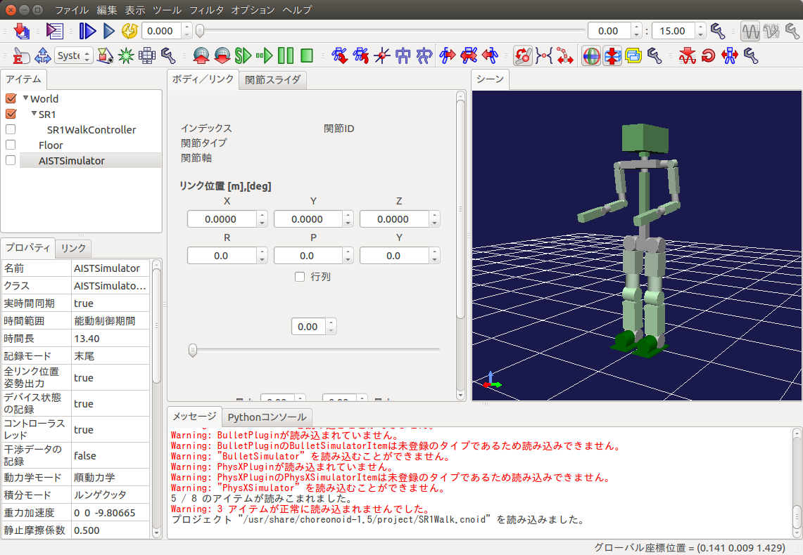
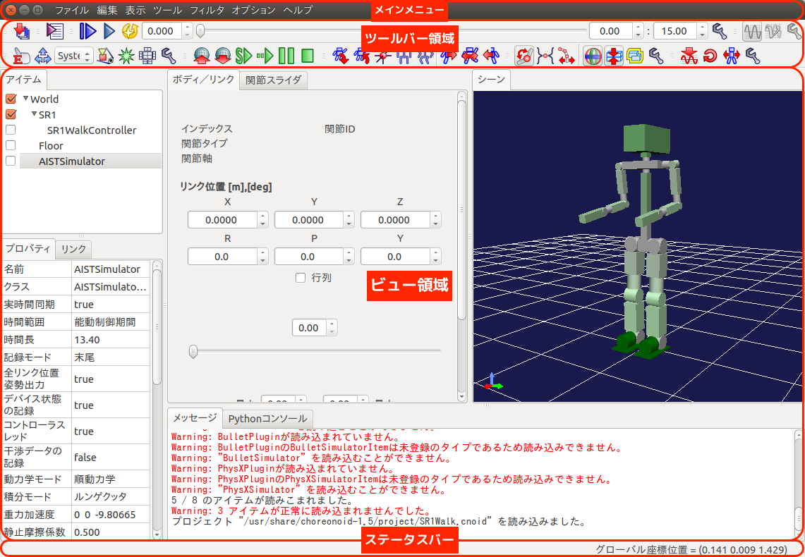

Choreonoidの基本操作
====================

この章ではサンプルプロジェクトを用いて、Choreonoidの基本的な操作方法について解説します。

起動方法
--------

端末などでChoreonoidの実行ファイル「choreonoid」を実行します。

.. code-block:: bash

 $ choreonoid

今回はサンプルプロジェクト「SR1Walk.cnoid」を同時に開くため、端末を開いて以下のコマンドを実行してください。
                
.. code-block:: bash

 $ choreonoid /usr/share/choreonoid-1.5/project/SR1Walk.cnoid

以下のような画面が表示されます。

.. note::
              
  Choreonoidの起動と同時に、OpenHRP形式のモデルを開く場合には以下のようにオプションを指定して実行することが可能です。

  .. code-block:: bash

   $ choreonoid --hrpmodel /usr/share/choreonoid-1.5/model/SR1/SR1.wrl

画面構成
--------

Choreonoidを起動すると表示される「メインウィンドウ」の構成は以下のようになっています。

メインメニュー
##############

この例ではメインメニューはウィンドウのタイトルバーの中に表示しています。
Ubuntuの標準設定ではメニューバーの中ですが、[システム設定]-[外観]-[挙動]-[ウィンドウのメニューを表示]で変更可能です。

ツールバー領域
##############

各種ツールバーを表示します。表示するツールバーの種類は[メインメニュー]-[表示]-[ツールバーの表示]でOn/Offが可能です。

ビュー領域
##########

各種ビューを表示します。この例では「アイテム」「プロパティ」「リンク」「ボディ／リンク」「関節スライダ」「シーン」「メッセージ」「Pythonコンソール」のビューを表示しています。
複数のビューを重ねてタブで切り替えることも可能です。

表示するビューの種類は[メインメニュー]-[表示]-[ビューの生成]でOn/Offが可能で、[ビューの生成]で同じビューを複数表示することが可能です。例えば、シーンビューを複数表示して、複数視点のシミュレーション世界を表示したり、ロボットのカメラ映像などを表示することができます。

ステータスバー
##############

メインウィンドウ下部のステータスバーは、Choreonoid上で現在進行中の処理内容を簡潔なメッセージで知らせるための領域です。

ステータスバーの領域は内部で２つに分かれており、基本的に左側では処理の開始や終了を告げるメッセージを表示し、右側では作業中のビューでマウスカーソルが指しているオブジェクトの状態を表示するようになっています。

視点操作
--------

シーンビューにマウスカーソルを合わせて、以下の操作を行うことによりシミュレーション世界の3Dグラフィックス表示を自在に操ることが可能です。

* 左ボタンドラッグでクリックした点周りに回転
* 中ボタンドラッグで並進
* ホイールで拡大縮小
* Shift+左ドラッグで真横、真上などにスナップ

また、ツールバーの下記シーンバーにあるボタン(全ての物体が見えるように視点を移動)を押すことで全体を俯瞰する視点に設定することが可能です。
視点位置がわからなくなった場合の初期化などに利用できます。

.. image:: images/scenebar_look_over_button.png

カメラの切り替え方法
--------------------

シーンビューの表示に使用するカメラは、シーンバーのプルダウンで選択します。
変更したいシーンビューをフォーカスしておき、プルダウンメニューから表示したいカメラを選択してください。

.. image:: images/scenebar_camera_select.png

デフォルトのカメラ
##################

デフォルトでは以下のカメラが用意されています。

* System - Perspectiveは透視投影

* System - Orthographicは平行投影

ロボットのカメラ
################

ロボットのカメラは以下の形式でリストアップされます。

* <ロボット名>-<カメラ名>

追跡カメラ
##########

カメラの視点をモデルに追従させたい場合などに、追跡視点に設定することが可能です。

1. 追従させたいモデルのBodyItemの子アイテムとて、"BodyTrackingCameraItem"を生成し、チェックを入れる

2. カメラ選択でこのアイテム名のカメラを選択

3. "Keep Relative Attitude"プロパティをtrueにしておくと、カメラの向きもロボットに追従する

シミュレーションの初期状態の編集方法
------------------------------------

ロボットの位置・姿勢の初期状態を設定してプロジェクトに保存しておくことで、Choreonoidを起動し直してプロジェクトを読み込んだ際に設定していた初期状態からシミュレーションを開始することが可能です。
初期状態の設定は以下の手順で行います。

1. ボディ／リンクビューでルートリンクの位置・姿勢を編集する。

2. 関節スライダビューで関節の角度を編集する。

3. シーンビュー上でインタラクティブに編集、逆運動学を用いた編集も可能です。

4. 最後にシミュレーションバーの「現在の状態をワールド初期状態に設定」ボタンを押して初期状態を設定し、

   .. image:: images/simubar_save_world.png

   ファイルバーの「プロジェクトを保存」するのを忘れないでください。

   .. image:: images/filebar_save_project.png

シミュレーションの基本設定（時間刻み、シミュレーション時間）
------------------------------------------------------------

時間刻み
########

1[ms] を推奨します。時間刻みは計算速度とシミュレーション精度のトレードオフであり、コントローラの実行周期との兼ね合いも考慮して設定します。

1. タイムバーの設定ダイアログをボタンをクリックする。

   .. image:: images/timebar_config.png

2. タイムバーの設定で、内部フレームレートの値を「1000」(1ms)に設定する。
       
   .. image:: images/timebar_config_framerate.png

シミュレーション時間
####################

* 無制限

  1. アイテムビュー上で "AISTSimulator" アイテムを選択状態にする。

  2. プロパティビューの時間範囲の値をダブルクリックして変更する。

     .. image:: images/property_timerange.png

* タイムバー範囲

  1. アイテムビュー上で "AISTSimulator" アイテムを選択状態にする。

  2. プロパティビューの時間範囲の値をダブルクリックして変更する。

     .. image:: images/property_timebarlimit.png

  3. タイムバーの開始時間と終了時間を設定する。
     
     .. image:: images/timebar_timelimit.png

.. * 実時間同期

.. * 積分方法
..   * ルンゲクッタで

.. * 摩擦係数
..   * 全ての物体間の摩擦係数は同じ

シミュレーション結果の保存、読み込み、再生方法
----------------------------------------------

* シミュレーションを行うと、ロボット等、動く物体のBodyItemの下（あるいはコントローラの下）に “AISTSimulator-XXX” といった名前でBodyMotionアイテムが生成される。これがシミュレーション結果を格納している動作軌道データ。
  
* 上記の各Bodyアイテムを選択状態にして（まとめて選択してもOK), 「ファイル」⇒「名前を付けて選択アイテムを保存」で保存
  
* 読み込みは、「ファイル」⇒「ボディモーション」で行う。それぞれのBodyアイテムを選択した状態で対応するファイルの読み込みを行う

* 読み込んだ動作データを再生するためには、それらを選択しておく必要がある。（複数物体がある場合は、全てのBodyMotionアイテムを選択）

* WorldLogFileItem

シミュレーション結果の動画作成方法
----------------------------------

1. 動画にしたい動きをタイムバーの再生ボタンで再生できる状態にしておく

2. 「ツール」⇒「Movie Generator」を呼び出す

3. 「対象ビュー」をクリックして設定

4. 「ディレクトリ」で連番ファイルを出力するディレクトリを設定

5. 「ベースファイル名」に連番画像ファイルのベースとなる名前を設定

6. 「開始時刻」、「終了時刻」を設定

7. 「FPS」にフレームレートを設定

8. 「画像サイズ」にチェックを入れると、画像サイズを指定できます。これについては、単に対象のビューの描画領域のサイズを一時的にそのサイズにするだけの機能です。このため注意として、もとのビューの大きさがここで指定する大きさ以上である必要があります。少し大きめにビューのサイズを変更してから実行するとよいかと思います。
   
9. 「生成」ボタンを押して連番画像を出力
   
10. 連番画像から動画を生成するコマンドを使用して動画を生成

  .. code-block:: bash

   $ avconv -r 15 -i source%04d.jpg -r 15 -an -vcodec libx264 -pix_fmt yuv420p video.mp4

閲覧モードと編集モード
----------------------

* ESCキー or 背景をダブルクリックで切り替え

  * エディットモードのときはマウスカーソルが手のアイコンになる

* 通常はビューモードにしておく

* エディットモードの時は物体を引っ張ったりできる

  * 初期状態の設定（シミュレーション前）

  * ロボットに外力を加える（シミュレーション中）

.. toctree::
   :maxdepth: 2
